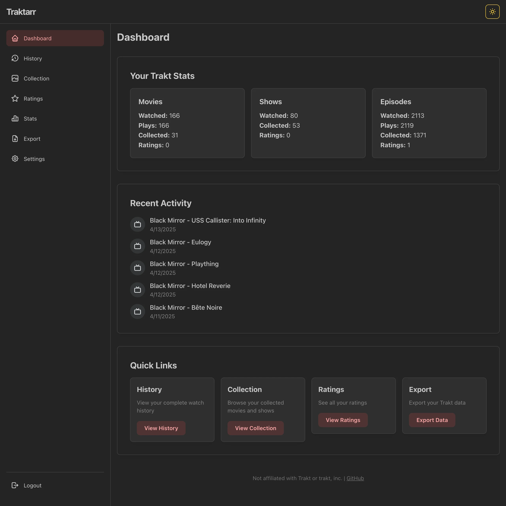

> [!WARNING]
> This project was written entirely by various LLMs, i.e. **vibe-coded**.  
> The code quality may be poor, as it was made for fun and as a one-off for a personal need. I literally haven't checked the vast majority of the code, but it works so ¯\\\_(ツ)\_/¯.  
> Use at your own risk!

> [!NOTE]
> I realize that this project technically cuts into Trakt's business model. Realistically, this is a very niche contraption for people that probably want to leave the Trakt platform regardless, like I did years ago with Simkl. I think "CSV Exports" are far enough down the selling point list that this is entirely irrelevant. Plus, there are similar projects out there, just without the nice UI. My personal opinion hardly matters, but it's very annoying that I have to pay a monthly fee to takeout the data that **I myself** have put into the Trakt platform.
>
> Also, this data is freely accessible via the API and Traktarr is entirely BYOK and intended for personal use only. So... sorry Trakt. No hard feelings? 💔

---

# [](//traktarr.igerman.cc) [Traktarr](//traktarr.igerman.cc) - Export *your* data


> A modern, user-friendly web application for exporting and visualizing your Trakt data.
> 
> Access, view, and export your data in various formats without requiring a paid subscription, because you should have your data.

<br>
<p align="center">

  <div align="center">	
  
[](//ko-fi.com/vizzy)
    
  </div>
</p>
<!--  -->

## Use now

I provide a hosted version of the app at [traktarr.igerman.cc](https://traktarr.igerman.cc) via GitHub Pages. Your data is never sent to my server, and all processing happens in your browser.

## Features

- **Authentication**: Secure device authentication with Trakt
- **Dashboard**: Overview of your Trakt activity and stats
- **Watch History**: View and filter your complete watch history
- **Collection**: Browse your movie and TV show collection
- **Ratings**: See all your ratings for movies, shows, seasons, and episodes
- **Statistics**: Visualize your watching habits with detailed statistics
- **Export**: Export your data in multiple formats (JSON, CSV)
- **Filtering**: Filter data by type, date, rating, and more

## Getting Started (Development)

### Prerequisites

- Node.js 20 or higher
- npm 10.7.0 or higher (or yarn 4.8.1+)

### Installation

1. Clone the repository:
   ```
   git clone https://github.com/yourusername/traktarr.git
   cd traktarr
   ```

2. Install dependencies:
   ```
   npm install
   ```
   or
   ```
   yarn install
   ```

### Creating a Trakt Application (Required)

> [!WARNING]
> This section is for **nerds**! If you just want to use the app, you can skip this part and use the hosted version - it will have better instructions.

This app uses a "Bring Your Own Key" (BYOK) approach, meaning you need to create your own Trakt application to get API credentials:

1. Go to [Trakt API Applications](https://trakt.tv/oauth/applications)
2. Sign in to your Trakt account (or create one if you don't have it)
3. Click on "New Application"
4. Fill in the application details:
   - **Name**: Traktarr (or any name you prefer)
   - **Description**: Personal app for exporting my Trakt data
   - **Redirect URI**:
     - `http://localhost:5173/auth` (for local development)
     - `urn:ietf:wg:oauth:2.0:oob` (**required** for device authentication)
   - **JavaScript Origins**: 
     - `http://localhost:5173`
5. Click "Save App"
6. You'll now see your `Client ID` and `Client Secret`
7. Copy these values for use in the dashboard

8. Start the development server:
   ```
   npm run dev
   ```
   or
   ```
   yarn dev
   ```

9. Open your browser and navigate to `http://localhost:5173`

## Building for Production

To build the app for production:

```
npm run build
```
or
```
yarn build
```

The built files will be in the `dist` directory.

## Technologies Used

- **React**: UI library
- **TypeScript**: Type-safe JavaScript
- **Vite**: Build tool and development server
- **Mantine**: UI component library
- **React Router**: Navigation and routing
- **Jotai**: State management
- **Trakt API**: Data source

## Privacy

This application runs entirely in your browser. Your Trakt credentials and data are never sent to any server other than Trakt's official API. All data processing happens locally on your device.

## License

This project is licensed under the GNU Affero General Public License v3.0. See the [LICENSE](LICENSE) file for details.

## Acknowledgments

- [Trakt](https://trakt.tv/) for their API
- [@dvcol/trakt-http-client](https://github.com/dvcol/trakt-http-client) for the Trakt API client library
